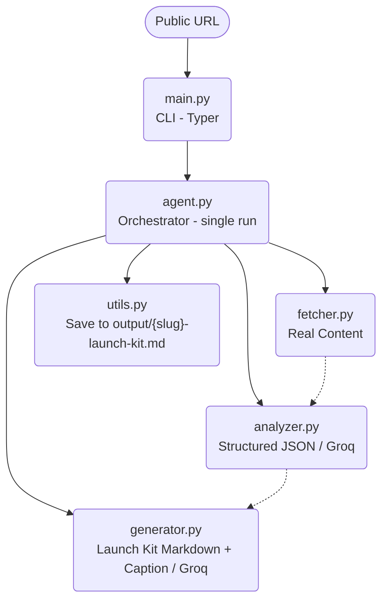
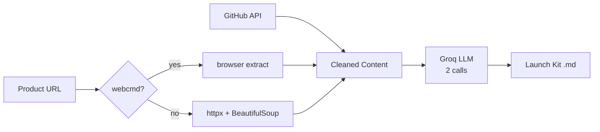

# DemoForge Architecture

DemoForge is a linear, unattended pipeline that turns any public URL into a complete Launch Kit.

## One-sentence summary

A strict four-stage pipeline (Fetch → Analyze → Generate → Save) that converts any public URL into a publish-ready Launch Kit, with optional webcmd-powered extraction and full free-tier operation.

## High-level flow



## Layers

| Layer          | Responsibility                              | Files                  |
|----------------|---------------------------------------------|------------------------|
| Interface      | Accept URL, print results, exit codes       | main.py                |
| Orchestration  | Fixed sequence, progress, error boundaries  | app/agent.py           |
| Acquisition    | Real content from GitHub or product pages   | app/fetcher.py         |
| Understanding  | Structured extraction via LLM               | app/analyzer.py        |
| Creation       | Launch Kit Markdown + caption               | app/generator.py       |
| Support        | Config, helpers, prompts                    | config, utils, prompts |
| Output         | Durable publish-ready file                  | output/                |

## Component contracts

### fetcher.py
- Input: `url: str`
- Output:
  ```json
  {
    "source_type": "github" | "product",
    "url": "...",
    "title": "...",
    "description": "...",
    "content": "..."
  }
  ```
- Strategy:
  1. GitHub → public API + raw README
  2. Product → webcmd (session + browser extract) if installed
  3. Fallback → httpx + BeautifulSoup + html2text

### analyzer.py
- Input: fetched dict
- Output: `AnalysisOutput` (Pydantic)
  - product_name, one_line_hook, what_it_is, problem_it_solves
  - key_features (list), how_it_works, getting_started_commands
  - target_audience, why_it_matters_now
  - alternative_hooks (exactly 3 strings)

### generator.py
- Input: `AnalysisOutput`
- Output: `{ "markdown": str, "caption": str }`

### agent.py
Single public function: `run(url: str) -> Path`

Fixed order:
1. Validate URL
2. Fetch
3. Analyze
4. Generate
5. Save
6. Print caption
7. Return path

## Data flow

1. `python main.py --url <public-url>`
2. Validate scheme (http/https)
3. Fetch live content
4. Analyze with Groq (JSON mode) → AnalysisOutput
5. Generate with Groq (JSON mode) → markdown + caption
6. Save `output/{slug}-launch-kit.md`
7. Print caption
8. Return path

Exactly two LLM calls. No loops. No replanning.

## Design principles

- Single responsibility per module
- Fail fast (missing key, bad URL, network error)
- Graceful degradation (webcmd optional)
- Deterministic pipeline
- Typed boundaries (Pydantic)
- Pure helpers (utils)
- Externalised prompts
- Free by default (Groq free tier + public APIs)

## External dependencies



## Failure model

| Failure                | Behaviour                          |
|------------------------|------------------------------------|
| No GROQ_API_KEY        | Hard error at config load          |
| Invalid URL            | Rejected before network            |
| GitHub / page error    | Clear exception, non-zero exit     |
| webcmd missing/broken  | Silent fallback to httpx           |
| Bad LLM JSON           | Strip fences → then fail           |

Never invents content.

## Output contract

Every successful run produces exactly one file:

```
output/{slug}-launch-kit.md
```

Containing:
- Title + strongest hook
- What it is
- Problem it solves
- Key features
- How it works
- Getting started
- Who it’s for
- Why interesting now
- Ready-to-post social caption
- Three alternative hooks

## Why this architecture

- Linear and easy to reason about under time pressure
- Each stage independently testable
- webcmd is a differentiator, not a hard dependency
- Two LLM calls keep latency and free-tier usage predictable
- Judges can run one command on an unseen URL and receive a real artifact
